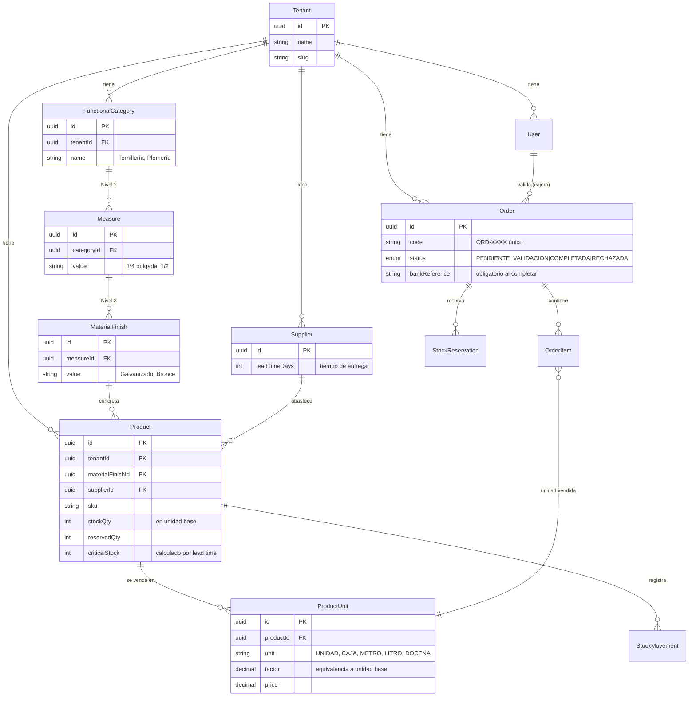

# Arquitectura — Ferremax SaaS ERP/POS

## 1. Multi-tenancy (multi-inquilino)

Estrategia: **base de datos compartida, esquema compartido, aislamiento por fila** mediante
una columna `tenantId` en cada tabla de negocio. Es la opción más barata de operar para un SaaS
con muchas ferreterías pequeñas, y se endurece con **Row-Level Security (RLS)** de PostgreSQL.

Cada request trae un JWT con el claim `tenantId`. El middleware (`middleware/tenant.ts`):

1. Valida el token y extrae `tenantId`.
2. Ejecuta `SET app.current_tenant = '<tenantId>'` en la conexión.
3. Las políticas RLS garantizan que ninguna query lea/escriba filas de otro tenant,
   incluso si un controlador olvida filtrar.

```sql
-- Política RLS aplicada a cada tabla de negocio
ALTER TABLE "Product" ENABLE ROW LEVEL SECURITY;
CREATE POLICY tenant_isolation ON "Product"
  USING ("tenantId" = current_setting('app.current_tenant')::uuid);
```

## 2. ERD (Entidad–Relación)



### Jerarquía de inventario (3 niveles)

El cliente **no** busca por proveedor; busca por **cómo usa el producto**:

```
Categoría Funcional   →   Medida        →   Material / Acabado   →   Producto (SKU)
(Tornillería)             (1/4")             (Galvanizado)            Tornillo 1/4" Galv.
(Plomería)                (1/2")             (Bronce)                 Codo 1/2" Bronce
```

El proveedor cuelga del `Product` como un atributo (`supplierId`), no como nodo de la jerarquía.

### Múltiples unidades

Cada `Product` guarda su stock en una **unidad base** (`stockQty`). Las formas de venta viven en
`ProductUnit` con un `factor` de equivalencia. Vender 1 `CAJA` (factor 100) descuenta 100 de la
unidad base. Así se soporta venta fraccionada (medio metro) y por bulto (caja, docena).

## 3. Stock crítico por lead time

```
criticalStock = ventaPromedioDiaria × leadTimeDays × factorSeguridad
```

Cuando `stockQty - reservedQty <= criticalStock`, el producto entra al reporte
**"Artículos a Comprar"**. La consulta está en
[`backend/src/modules/inventory/purchaseReport.sql`](../backend/src/modules/inventory/purchaseReport.sql).

## 4. Reserva temporal de stock (Fase 2)

```
Crear orden  → reservedQty += cantidad   (disponible = stockQty - reservedQty)
Completar    → stockQty -= cantidad; reservedQty -= cantidad
Rechazar     → reservedQty -= cantidad   (stock vuelve a estar disponible)
Expiración   → job libera reservas > 24h sin validar
```

## 5. Offline-first y reconciliación (Fase 3)

El POS escribe ventas en IndexedDB con un `clientId` (UUID generado en el dispositivo) y
`updatedAt`. El Service Worker, al recuperar conexión, las envía al backend. Conflictos
(mismo producto vendido en dos cajas offline) se resuelven con **Last-Write-Wins por timestamp**
y, para stock, con **delta merge**: el servidor aplica los decrementos de ambas cajas y, si el
stock resultante es negativo, marca la orden más reciente como `REQUIERE_REVISION`.
